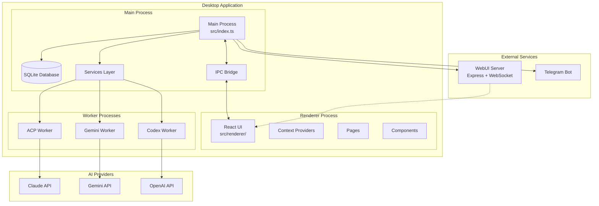
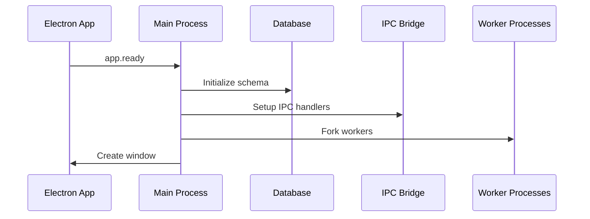
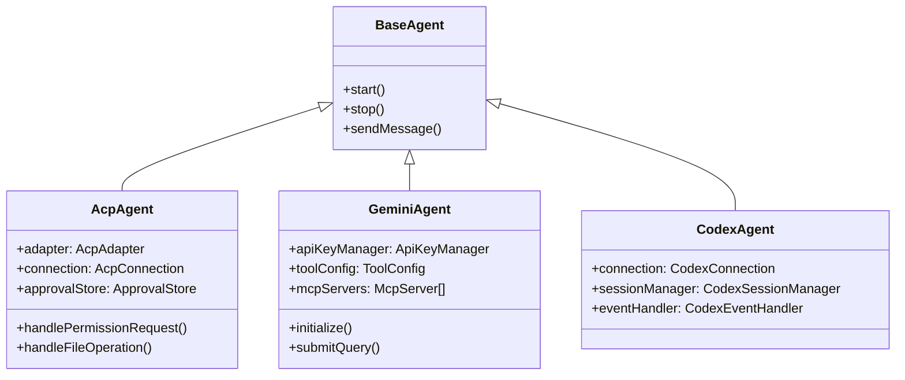
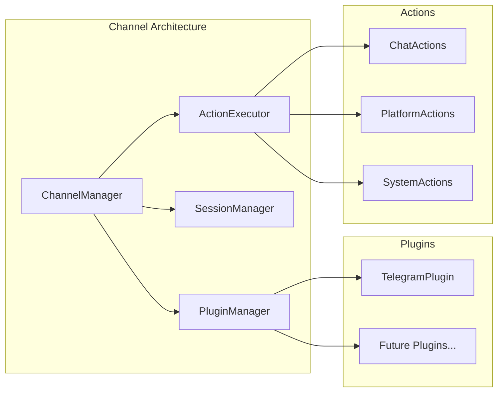
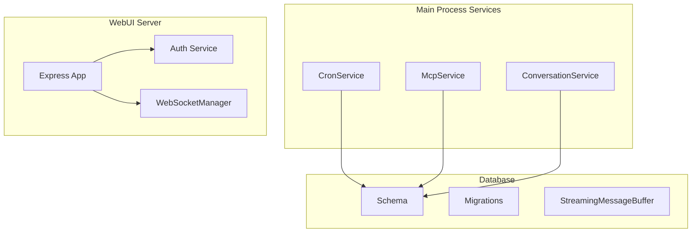
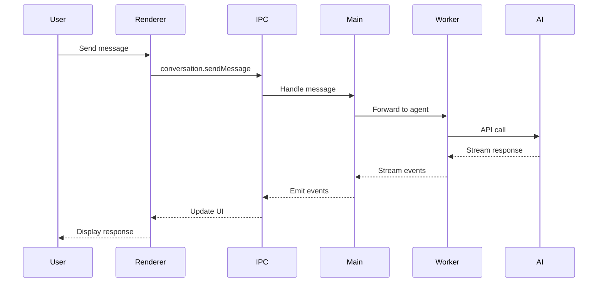
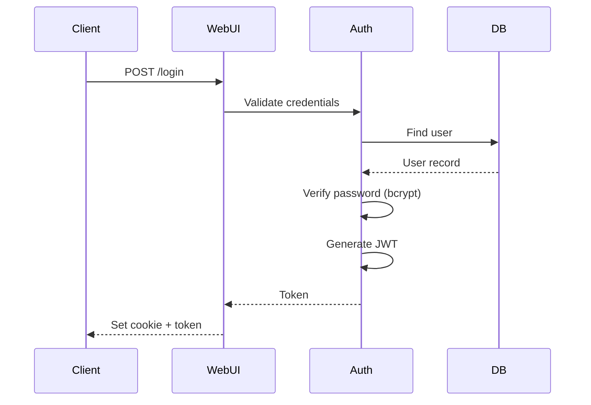

# AionUI Architecture Documentation

## Overview

AionUI is a multi-process Electron application that transforms CLI AI agents into a modern chat interface. It supports Claude Code (ACP), Google Gemini, and OpenAI Codex agents.

## System Architecture



## Process Model

### Main Process (`src/index.ts`)

The main process handles:

- **Application Lifecycle**: Window creation, app events
- **Database Operations**: SQLite via better-sqlite3
- **IPC Communication**: Bridge between renderer and main
- **Service Orchestration**: Managing agent workers and services



### Renderer Process (`src/renderer/`)

React-based UI with:

- **Pages**: Conversation, Settings, Cron, Login
- **Context Providers**: Auth, Conversation, Theme, Layout
- **Components**: Reusable UI components
- **Hooks**: Custom React hooks for state and effects

### Worker Processes (`src/worker/`)

Isolated processes for AI agents:

| Worker | File | Purpose |
|--------|------|---------|
| Gemini | `gemini.ts` | Google Gemini CLI integration |
| Codex | `codex.ts` | OpenAI Codex integration |
| ACP | `acp.ts` | Claude Code (ACP) integration |

## Component Architecture

### AI Agents



### Channel System



### Services Layer



## Data Flow

### Message Flow



### Authentication Flow (WebUI)



## Database Schema

### Core Tables

```sql
-- Conversations
CREATE TABLE conversations (
    id TEXT PRIMARY KEY,
    title TEXT,
    type TEXT,
    workspace TEXT,
    created_at INTEGER,
    updated_at INTEGER
);

-- Messages
CREATE TABLE messages (
    id TEXT PRIMARY KEY,
    conversation_id TEXT,
    msg_id TEXT,
    type TEXT,
    content TEXT,
    status TEXT,
    position INTEGER,
    created_at INTEGER
);

-- Cron Jobs
CREATE TABLE cron_jobs (
    id TEXT PRIMARY KEY,
    name TEXT,
    schedule TEXT,
    conversation_id TEXT,
    message TEXT,
    agent_type TEXT,
    enabled INTEGER,
    last_run INTEGER,
    next_run INTEGER
);

-- Users (WebUI)
CREATE TABLE users (
    id TEXT PRIMARY KEY,
    username TEXT UNIQUE,
    password_hash TEXT,
    created_at INTEGER,
    last_login INTEGER
);
```

## IPC Communication

### Bridge Structure

```typescript
// src/common/ipcBridge.ts
const ipcBridge = {
  conversation: {
    create: { provider, invoker },
    sendMessage: { provider, invoker },
    stop: { provider, invoker },
    // ...
  },
  mcpService: {
    testMcpConnection: { provider, invoker },
    syncMcpToAgents: { provider, invoker },
    // ...
  },
  application: {
    openDevTools: { provider, invoker },
    // ...
  }
};
```

### Preload Script

```typescript
// src/preload.ts - Exposed to renderer
contextBridge.exposeInMainWorld('electron', {
  emit: (name, data) => ipcRenderer.send('channel', { name, data }),
  on: (name, callback) => { /* listener setup */ },
  getPathForFile: (file) => webUtils.getPathForFile(file),
  webuiGetStatus: () => ipcRenderer.invoke('webui:getStatus'),
  webuiChangePassword: (pwd) => ipcRenderer.invoke('webui:changePassword', pwd),
  webuiGenerateQRToken: () => ipcRenderer.invoke('webui:generateQRToken'),
  webuiResetPassword: () => ipcRenderer.invoke('webui:resetPassword'),
});
```

## Security Considerations

### Authentication

- **JWT Tokens**: Used for session management
- **bcrypt**: Password hashing
- **Token Blacklist**: Invalidated tokens stored
- **Rate Limiting**: Per-endpoint limits

### WebUI Security

- **CSRF Protection**: Token-based
- **Secure Cookies**: HttpOnly, SameSite, Secure (in remote mode)
- **Input Validation**: Request body validation middleware
- **Rate Limiting**: Brute-force protection on login

### Agent Permissions

- **ApprovalStore**: Session-level permission caching
- **Permission Requests**: User confirmation for sensitive operations
- **File Operations**: Controlled access to workspace

## Deployment Modes

### Desktop Mode (Default)

- Full Electron application
- Local database
- Direct IPC communication

### WebUI Mode

```bash
npm run webui        # Local access only
npm run webui:remote # Network access enabled
```

- Express server on configurable port
- WebSocket for real-time updates
- JWT authentication required

## Configuration

### Environment Variables

| Variable | Description | Default |
|----------|-------------|---------|
| `WEBUI_PORT` | WebUI server port | 3000 |
| `WEBUI_REMOTE` | Enable remote access | false |
| `NODE_ENV` | Environment | development |

### Build Configuration

- **Electron Forge**: Development and packaging
- **Electron Builder**: Production builds
- **Webpack**: Module bundling
- **UnoCSS**: Styling

## Performance Considerations

- **Worker Processes**: AI agents run in isolated processes
- **Streaming**: Responses streamed to avoid memory buildup
- **Message Buffer**: Batched database writes for streaming
- **Virtualized Lists**: React Virtuoso for message lists
