# AionUI Architecture Documentation

## Overview

AionUI is a multi-process Electron application that transforms CLI AI agents into a modern chat interface. It supports Claude Code (ACP), Google Gemini, OpenAI Codex, and additional multi-agent CLIs. The enterprise fork adds per-user isolation, Knowledge Base (RAG), Global Models administration, Python workspace management, OIDC SSO, and Docker deployment with optional HTTPS via nginx.

## System Architecture

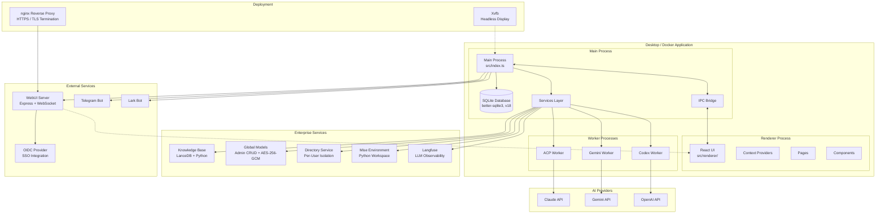

## Process Model

### Main Process (`src/index.ts`)

The main process handles:

- **Application Lifecycle**: Window creation, app events
- **Database Operations**: SQLite via better-sqlite3 (WAL mode, schema v18)
- **IPC Communication**: Bridge between renderer and main
- **Service Orchestration**: Managing agent workers, enterprise services, and channel plugins

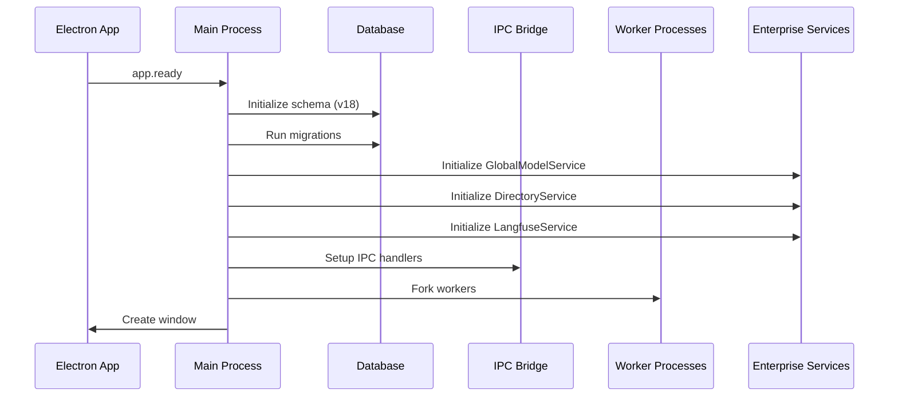

### Renderer Process (`src/renderer/`)

React-based UI with:

- **Pages**: admin, conversation, cron, guid, login, profile, settings, test
- **Settings Sub-Pages**: About, AgentSettings, ApiKeysSettings, AssistantManagement, CustomAcpAgent, DisplaySettings, GeminiSettings, KnowledgeBase, McpManagement, ModeSettings, PresetManagement, PythonEnvironment, SystemSettings, ToolsSettings, WebuiSettings
- **Context Providers**: Auth, Conversation, Theme, Layout
- **Components**: Reusable UI components
- **Hooks**: Custom React hooks for state and effects

### Worker Processes (`src/worker/`)

Isolated processes for AI agents:

| Worker | File | Purpose |
|--------|------|---------|
| Gemini | `gemini.ts` | Google Gemini CLI integration |
| Codex | `codex.ts` | OpenAI Codex integration |
| ACP | `acp.ts` | Claude Code (ACP) integration |

## Component Architecture

### AI Agents

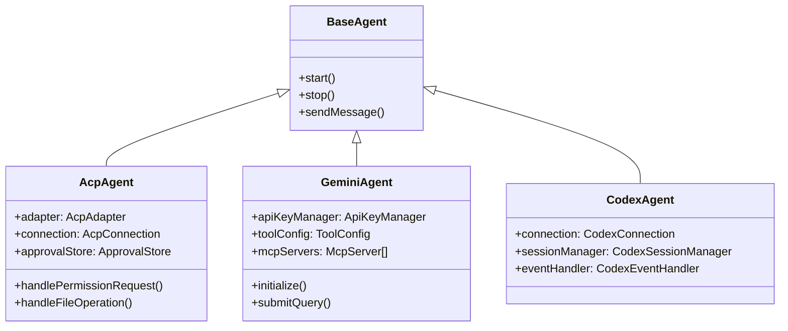

### Channel System

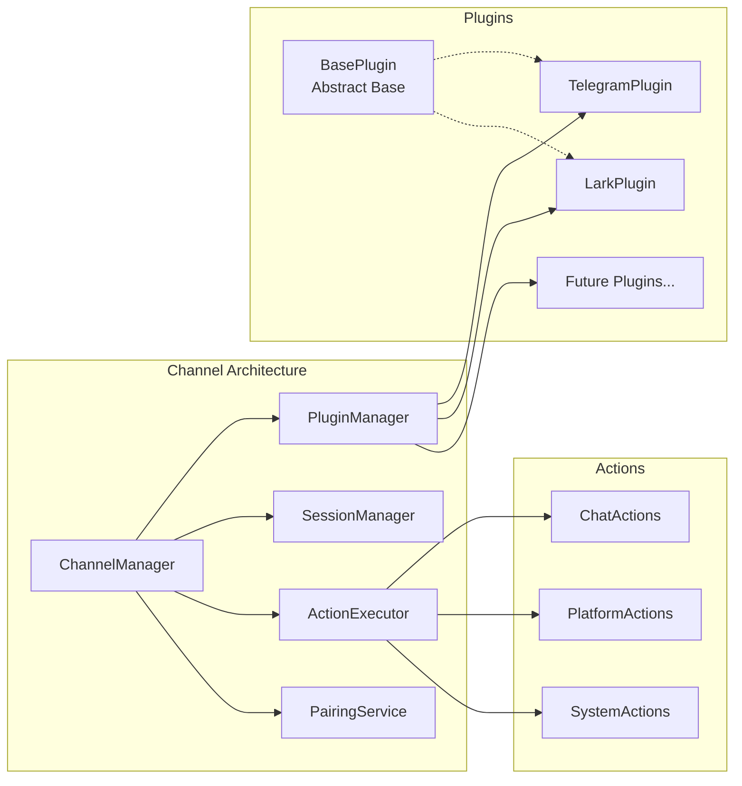

**Plugin Lifecycle:**

```
created → initializing → ready → starting → running → stopping → stopped
               ↓                    ↓           ↓
             error ←←←←←←←←←←←←←←←←←←←←←←←←←←←←
```

Plugins implement `BasePlugin` abstract class with platform-specific logic for:
- Connection management (`onInitialize`, `onStart`, `onStop`)
- Message conversion (platform format ↔ unified format)
- Message sending and editing (for streaming updates)
- Bot info and active user tracking

### Services Layer

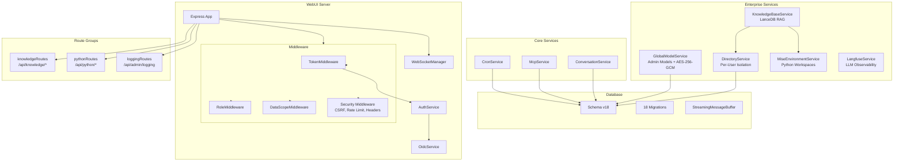

#### KnowledgeBaseService

RAG integration using LanceDB via Python scripts:

- **Embedding**: Configurable via `EMBEDDING_MODEL`, `EMBEDDING_API_KEY`, `EMBEDDING_BASE_URL`, `EMBEDDING_DIMENSIONS`
- **Search Modes**: Vector (semantic), FTS (keyword), Hybrid (RRF reranking)
- **Ingestion**: Text and binary file support (PDFs via pypdf), automatic chunking with configurable chunk size and overlap
- **Progress Tracking**: Stage-based progress (`extracting → setup → chunking → embedding → indexing → complete`) via streaming stderr
- **Context Management**: Token estimation, context window management, formatted context injection with source attribution
- **Version Control**: LanceDB versioning, restore to specific versions
- **Architecture**: Main process delegates to Python scripts in `skills/lance/scripts/` via MiseEnvironmentService

#### GlobalModelService

Admin-managed shared model configurations:

- **CRUD**: Create, read, update, delete global models (admin only)
- **Encryption**: API keys encrypted with AES-256-GCM, key derived from JWT_SECRET via SHA-256 + HMAC
- **Model Resolution**: Merges user local models + visible global models. Priority: user local → global (by priority DESC)
- **Group-Based Access**: `allowed_groups` column (v18) restricts model visibility by OIDC group membership. Supports both direct group ID match and name→ID resolution via `GROUP_MAPPINGS`
- **User Overrides**: Users can hide global models or mark as modified with local copy
- **Embedding Discovery**: `getEmbeddingConfig()` finds embedding-capable global models for KB use

#### DirectoryService

Per-user workspace isolation with hierarchical resolution:

- **User Directories**: `base_dir`, `cache_dir`, `work_dir`, `skills_dir`, `assistants_dir` — per user under `{cacheDir}/users/{userId}/`
- **Team Directories**: Shared skills, assistants, workspace per team under `{cacheDir}/organizations/{orgId}/teams/{teamId}/`
- **Organization Directories**: Shared skills and assistants per org
- **Resolution Chain**: `user → team(s) → organization → global → builtin` — first match wins
- **Resource Resolution**: `resolveSkillPath()` and `resolveAssistantPath()` walk the chain
- **Lazy Creation**: Directories created on first access, persisted in DB

#### MiseEnvironmentService

Python environment management via [mise](https://mise.jdx.dev):

- **Runtime Management**: Python 3.14 + uv (fast pip alternative) via mise
- **Per-User Venvs**: Each user gets isolated `.venv` in their workspace
- **Template Venv**: Pre-built venv copied (~1s) instead of pip install (~113s) for new users
- **Package Management**: Install individual packages or requirements.txt via `uv pip install`
- **Security**: Only absolute paths allowed for mise binary, `execFileSync`/`execFileAsync` used exclusively (no shell)
- **Docker Integration**: Global Python/uv pre-installed, template venv with all skill dependencies baked into image

#### LangfuseService

LLM observability via [Langfuse](https://langfuse.com):

- **Trace Generations**: Model, input/output, token usage, user/session context
- **Trace Conversations**: Multi-step workflows with span tracking
- **Configuration**: `LANGFUSE_ENABLED`, `LANGFUSE_HOST`, `LANGFUSE_PUBLIC_KEY`, `LANGFUSE_SECRET_KEY`
- **Admin UI**: Configurable at runtime via logging admin API

## REST API Routes

### Knowledge Base Routes (`/api/knowledge/*`)

All endpoints authenticated and user-scoped.

| Method | Path | Description |
|--------|------|-------------|
| `GET` | `/api/knowledge/status` | KB status (doc count, chunk count, storage MB) |
| `GET` | `/api/knowledge/documents` | List indexed documents (limit, offset, source filter) |
| `GET` | `/api/knowledge/search` | Search KB (vector/fts/hybrid, limit, filter) |
| `POST` | `/api/knowledge/ingest` | Ingest document (source, text, chunkSize, overlap) |
| `DELETE` | `/api/knowledge/document/:source` | Delete document by source file |
| `POST` | `/api/knowledge/reindex` | Rebuild all indexes |
| `GET` | `/api/knowledge/versions` | List version history |
| `POST` | `/api/knowledge/restore` | Restore to specific version |
| `POST` | `/api/knowledge/clear` | Clear all KB data (requires `{ confirm: true }`) |

### Python Environment Routes (`/api/python/*`)

All endpoints authenticated and user-scoped.

| Method | Path | Description |
|--------|------|-------------|
| `GET` | `/api/python/status` | Workspace status (Python version, venv, packages) |
| `GET` | `/api/python/packages` | List installed packages (name, version, specifier) |
| `POST` | `/api/python/install` | Install a package (`{ package: "requests>=2.0" }`) |
| `POST` | `/api/python/install-requirements` | Install from requirements.txt (relative path only) |
| `POST` | `/api/python/reset` | Reset Python environment (delete + recreate venv) |
| `GET` | `/api/python/version` | Get mise and Python version info |

### Logging Admin Routes (`/api/admin/logging`)

All endpoints require admin role.

| Method | Path | Description |
|--------|------|-------------|
| `GET` | `/api/admin/logging` | Get current logging configuration (secrets masked) |
| `PATCH` | `/api/admin/logging` | Update logging config (log level, OTEL, syslog, Langfuse) |
| `GET` | `/api/admin/logging/level` | Get current runtime log level |
| `POST` | `/api/admin/logging/level` | Change runtime log level immediately |
| `POST` | `/api/admin/logging/test-syslog` | Test syslog connectivity (UDP/TCP/TLS) |

## Data Flow

### Message Flow

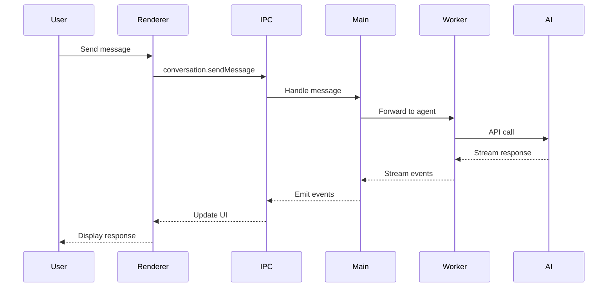

### RAG-Augmented Message Flow

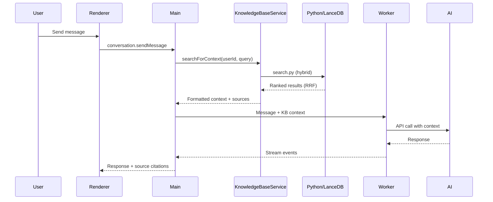

### Authentication Flow (WebUI)

#### OIDC Authentication (Primary)

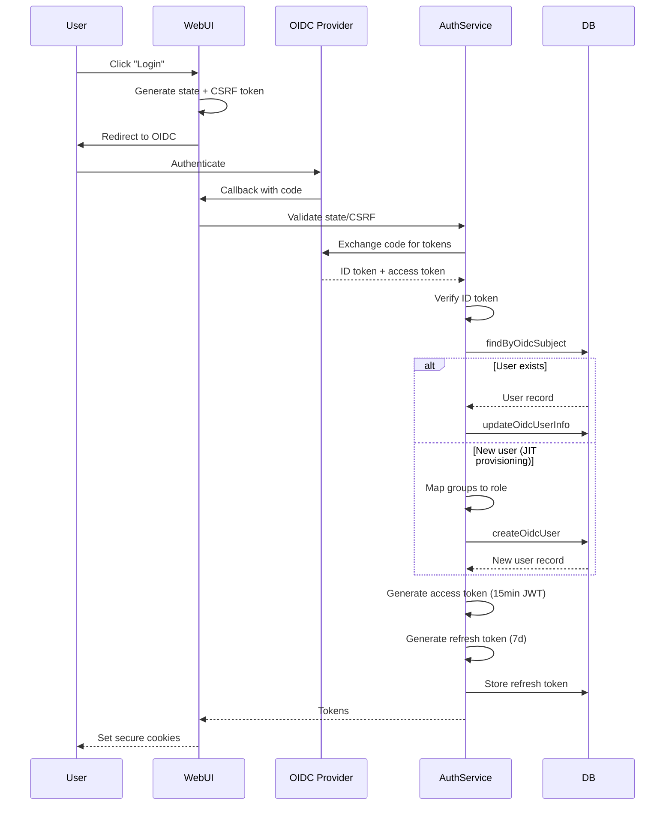

#### Token Refresh Flow

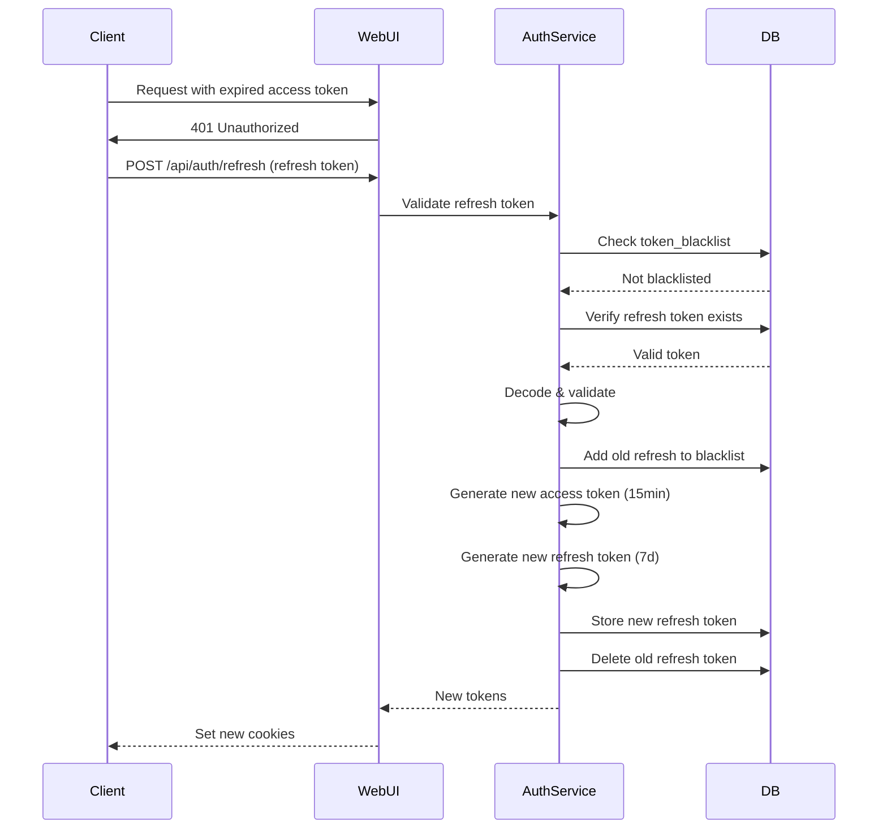

#### Local Authentication (Fallback)

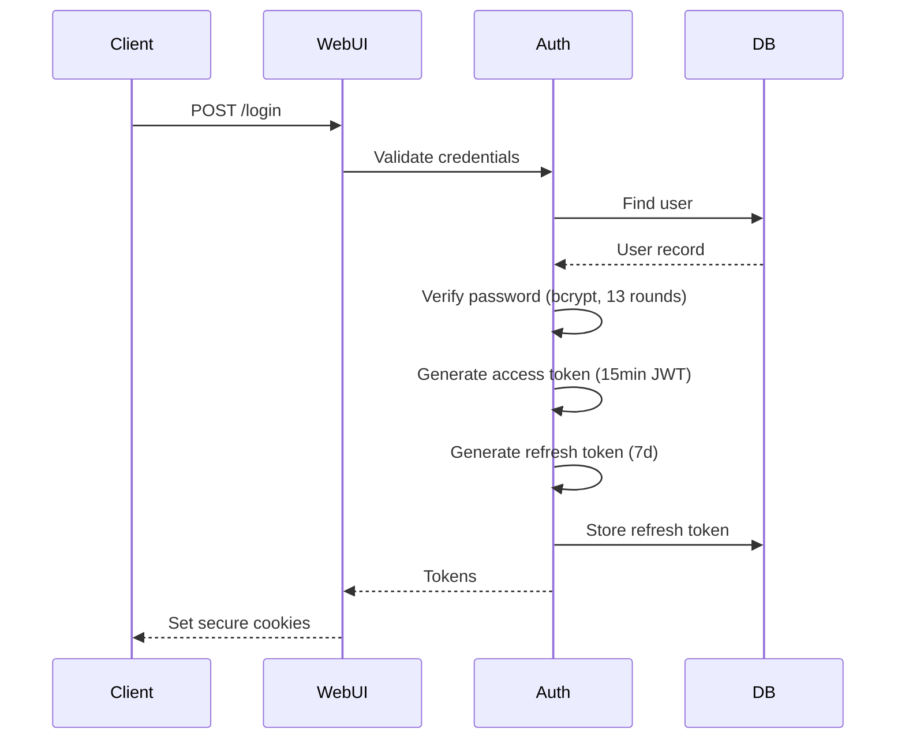

## Database Schema

**Current Version: 18** — 18 migrations from v1 (initial) to v18 (group-based model access).

### Tables Overview

| Table | Version | Purpose |
|-------|---------|---------|
| `users` | v1 (extended v6,v10,v12) | User accounts (local + OIDC) |
| `conversations` | v1 (extended v8) | Chat conversations (gemini/acp/codex) |
| `messages` | v1 | Chat messages with streaming status |
| `assistant_plugins` | v7 (extended v13) | Channel plugins (Telegram, Lark) |
| `assistant_users` | v7 | Channel platform users |
| `assistant_sessions` | v7 | Channel user sessions |
| `assistant_pairing_codes` | v7 | Secure pairing codes |
| `cron_jobs` | v9 | Scheduled tasks |
| `refresh_tokens` | v11 | JWT refresh token storage |
| `token_blacklist` | v11 | Revoked JWT tracking |
| `user_api_keys` | v14 | Per-user API key storage |
| `organizations` | v15 | Multi-tenant organizations |
| `teams` | v15 | Organization teams |
| `user_directories` | v15 | Per-user directory mappings |
| `team_directories` | v15 | Team shared directory mappings |
| `org_directories` | v15 | Organization shared directory mappings |
| `global_models` | v16 (extended v18) | Admin-managed shared model configs |
| `user_model_overrides` | v16 | Per-user global model overrides |
| `logging_config` | v17 | Runtime logging configuration |

### Core Tables

```sql
-- Users (v1, extended v6/v10/v12)
CREATE TABLE users (
    id TEXT PRIMARY KEY,
    username TEXT UNIQUE NOT NULL,
    email TEXT UNIQUE,
    password_hash TEXT NOT NULL,
    avatar_path TEXT,
    avatar_url TEXT,                      -- v12
    jwt_secret TEXT,                      -- v6
    role TEXT DEFAULT 'user',             -- v10: 'admin', 'user', 'viewer'
    auth_method TEXT DEFAULT 'local',     -- v10: 'local' or 'oidc'
    oidc_subject TEXT,                    -- v10: OIDC sub claim
    display_name TEXT,                    -- v10
    groups TEXT,                          -- v10: JSON array of group memberships
    created_at INTEGER NOT NULL,
    updated_at INTEGER NOT NULL,
    last_login INTEGER
);

-- Conversations (v1, extended v8)
CREATE TABLE conversations (
    id TEXT PRIMARY KEY,
    user_id TEXT NOT NULL,
    name TEXT NOT NULL,
    type TEXT NOT NULL CHECK(type IN ('gemini', 'acp', 'codex')),
    extra TEXT NOT NULL,
    model TEXT,
    status TEXT CHECK(status IN ('pending', 'running', 'finished')),
    source TEXT CHECK(source IN ('aionui', 'telegram', 'lark')),  -- v8/v13
    created_at INTEGER NOT NULL,
    updated_at INTEGER NOT NULL,
    FOREIGN KEY (user_id) REFERENCES users(id) ON DELETE CASCADE
);

-- Messages (v1)
CREATE TABLE messages (
    id TEXT PRIMARY KEY,
    conversation_id TEXT NOT NULL,
    msg_id TEXT,
    type TEXT NOT NULL,
    content TEXT NOT NULL,
    position TEXT CHECK(position IN ('left', 'right', 'center', 'pop')),
    status TEXT CHECK(status IN ('finish', 'pending', 'error', 'work')),
    created_at INTEGER NOT NULL,
    FOREIGN KEY (conversation_id) REFERENCES conversations(id) ON DELETE CASCADE
);

-- Cron Jobs (v9)
CREATE TABLE cron_jobs (
    id TEXT PRIMARY KEY,
    name TEXT,
    schedule TEXT,
    conversation_id TEXT,
    message TEXT,
    agent_type TEXT,
    enabled INTEGER,
    last_run INTEGER,
    next_run INTEGER
);
```

### Authentication Tables

```sql
-- Refresh Tokens (v11)
CREATE TABLE refresh_tokens (
    id TEXT PRIMARY KEY,
    user_id TEXT NOT NULL,
    token_hash TEXT NOT NULL,
    expires_at INTEGER NOT NULL,
    created_at INTEGER NOT NULL,
    FOREIGN KEY (user_id) REFERENCES users(id) ON DELETE CASCADE
);

-- Token Blacklist (v11)
CREATE TABLE token_blacklist (
    jti TEXT PRIMARY KEY,                -- JWT ID
    exp INTEGER NOT NULL,                -- Expiration timestamp
    blacklisted_at INTEGER NOT NULL
);
```

### Enterprise Tables

```sql
-- Global Models (v16, extended v18)
CREATE TABLE global_models (
    id TEXT PRIMARY KEY,
    platform TEXT NOT NULL,              -- e.g., 'openai', 'anthropic'
    name TEXT NOT NULL,
    base_url TEXT NOT NULL DEFAULT '',
    encrypted_api_key TEXT,              -- AES-256-GCM encrypted
    models TEXT NOT NULL DEFAULT '[]',   -- JSON array of model names
    capabilities TEXT,                   -- JSON array (e.g., ["vision","embedding"])
    context_limit INTEGER,
    custom_headers TEXT,                 -- JSON object for gateway headers
    enabled INTEGER NOT NULL DEFAULT 1,
    priority INTEGER NOT NULL DEFAULT 0, -- Display order (higher=first)
    allowed_groups TEXT,                 -- v18: JSON array of group IDs/names (null=everyone)
    created_by TEXT NOT NULL,
    created_at INTEGER NOT NULL,
    updated_at INTEGER NOT NULL,
    FOREIGN KEY (created_by) REFERENCES users(id)
);

-- User Model Overrides (v16)
CREATE TABLE user_model_overrides (
    id TEXT PRIMARY KEY,
    user_id TEXT NOT NULL,
    global_model_id TEXT NOT NULL,
    override_type TEXT NOT NULL,         -- 'hidden' or 'modified'
    local_provider_id TEXT,
    created_at INTEGER NOT NULL,
    updated_at INTEGER NOT NULL,
    FOREIGN KEY (user_id) REFERENCES users(id) ON DELETE CASCADE,
    FOREIGN KEY (global_model_id) REFERENCES global_models(id) ON DELETE CASCADE,
    UNIQUE(user_id, global_model_id)
);

-- User API Keys (v14)
CREATE TABLE user_api_keys (
    id TEXT PRIMARY KEY,
    user_id TEXT NOT NULL,
    provider TEXT NOT NULL,
    encrypted_key TEXT NOT NULL,
    created_at INTEGER NOT NULL,
    updated_at INTEGER NOT NULL,
    FOREIGN KEY (user_id) REFERENCES users(id) ON DELETE CASCADE
);

-- Logging Config (v17)
CREATE TABLE logging_config (
    id TEXT PRIMARY KEY DEFAULT 'default',
    log_level TEXT NOT NULL DEFAULT 'info',
    log_format TEXT DEFAULT 'json',
    log_file TEXT,
    retention_days INTEGER DEFAULT 30,
    max_size_mb INTEGER DEFAULT 500,
    destinations TEXT DEFAULT '["stdout"]',
    otel_enabled INTEGER NOT NULL DEFAULT 0,
    otel_endpoint TEXT,
    otel_protocol TEXT DEFAULT 'http',
    otel_service_name TEXT DEFAULT 'aionui',
    otel_log_level TEXT DEFAULT 'info',
    syslog_enabled INTEGER NOT NULL DEFAULT 0,
    syslog_host TEXT,
    syslog_port INTEGER DEFAULT 514,
    syslog_protocol TEXT DEFAULT 'udp',
    syslog_facility INTEGER DEFAULT 16,
    langfuse_enabled INTEGER NOT NULL DEFAULT 0,
    langfuse_host TEXT DEFAULT 'https://cloud.langfuse.com',
    langfuse_public_key TEXT,
    langfuse_secret_key TEXT,
    updated_by TEXT,
    updated_at INTEGER NOT NULL
);
```

### Multi-Tenant Tables

```sql
-- Organizations (v15)
CREATE TABLE organizations (
    id TEXT PRIMARY KEY,
    name TEXT NOT NULL,
    created_at INTEGER NOT NULL,
    updated_at INTEGER NOT NULL
);

-- Teams (v15)
CREATE TABLE teams (
    id TEXT PRIMARY KEY,
    org_id TEXT NOT NULL,
    name TEXT NOT NULL,
    created_at INTEGER NOT NULL,
    updated_at INTEGER NOT NULL,
    FOREIGN KEY (org_id) REFERENCES organizations(id) ON DELETE CASCADE
);

-- User Directories (v15)
CREATE TABLE user_directories (
    id TEXT PRIMARY KEY,
    user_id TEXT NOT NULL UNIQUE,
    base_dir TEXT NOT NULL,
    cache_dir TEXT NOT NULL,
    work_dir TEXT NOT NULL,
    skills_dir TEXT,
    assistants_dir TEXT,
    created_at INTEGER NOT NULL,
    updated_at INTEGER NOT NULL,
    FOREIGN KEY (user_id) REFERENCES users(id) ON DELETE CASCADE
);

-- Team Directories (v15)
CREATE TABLE team_directories (
    id TEXT PRIMARY KEY,
    team_id TEXT NOT NULL UNIQUE,
    base_dir TEXT NOT NULL,
    shared_skills_dir TEXT,
    shared_assistants_dir TEXT,
    shared_workspace_dir TEXT,
    created_at INTEGER NOT NULL,
    updated_at INTEGER NOT NULL,
    FOREIGN KEY (team_id) REFERENCES teams(id) ON DELETE CASCADE
);

-- Org Directories (v15)
CREATE TABLE org_directories (
    id TEXT PRIMARY KEY,
    org_id TEXT NOT NULL UNIQUE,
    base_dir TEXT NOT NULL,
    shared_skills_dir TEXT,
    shared_assistants_dir TEXT,
    created_at INTEGER NOT NULL,
    updated_at INTEGER NOT NULL,
    FOREIGN KEY (org_id) REFERENCES organizations(id) ON DELETE CASCADE
);
```

### Channel Tables

```sql
-- Channel Plugins (v7, extended v13)
CREATE TABLE assistant_plugins (
    id TEXT PRIMARY KEY,
    type TEXT NOT NULL CHECK(type IN ('telegram', 'slack', 'discord', 'lark')),
    name TEXT NOT NULL,
    enabled INTEGER NOT NULL DEFAULT 0,
    credentials TEXT,                    -- JSON (encrypted at rest)
    config TEXT,                         -- JSON plugin config
    status TEXT DEFAULT 'created',
    created_at INTEGER NOT NULL,
    updated_at INTEGER NOT NULL
);

-- Channel Users (v7)
CREATE TABLE assistant_users (
    id TEXT PRIMARY KEY,
    platform_user_id TEXT NOT NULL,
    platform TEXT NOT NULL,
    user_id TEXT,                         -- Linked AionUI user
    display_name TEXT,
    status TEXT DEFAULT 'active',
    created_at INTEGER NOT NULL,
    updated_at INTEGER NOT NULL,
    FOREIGN KEY (user_id) REFERENCES users(id)
);

-- Channel Sessions (v7)
CREATE TABLE assistant_sessions (
    id TEXT PRIMARY KEY,
    user_id TEXT NOT NULL,
    conversation_id TEXT,
    platform TEXT NOT NULL,
    chat_id TEXT NOT NULL,
    status TEXT DEFAULT 'active',
    created_at INTEGER NOT NULL,
    updated_at INTEGER NOT NULL,
    FOREIGN KEY (user_id) REFERENCES assistant_users(id)
);

-- Pairing Codes (v7)
CREATE TABLE assistant_pairing_codes (
    id TEXT PRIMARY KEY,
    code TEXT UNIQUE NOT NULL,
    user_id TEXT NOT NULL,
    platform TEXT NOT NULL,
    platform_user_id TEXT NOT NULL,
    status TEXT DEFAULT 'pending',
    expires_at INTEGER NOT NULL,
    created_at INTEGER NOT NULL
);
```

## IPC Communication

### Bridge Structure

```typescript
// src/common/ipcBridge.ts
const ipcBridge = {
  conversation: {
    create: { provider, invoker },
    sendMessage: { provider, invoker },
    stop: { provider, invoker },
    // ...
  },
  mcpService: {
    testMcpConnection: { provider, invoker },
    syncMcpToAgents: { provider, invoker },
    // ...
  },
  application: {
    openDevTools: { provider, invoker },
    // ...
  }
};
```

### Preload Script

```typescript
// src/preload.ts - Exposed to renderer
contextBridge.exposeInMainWorld('electron', {
  emit: (name, data) => ipcRenderer.send('channel', { name, data }),
  on: (name, callback) => { /* listener setup */ },
  getPathForFile: (file) => webUtils.getPathForFile(file),
  webuiGetStatus: () => ipcRenderer.invoke('webui:getStatus'),
  webuiChangePassword: (pwd) => ipcRenderer.invoke('webui:changePassword', pwd),
  webuiGenerateQRToken: () => ipcRenderer.invoke('webui:generateQRToken'),
  webuiResetPassword: () => ipcRenderer.invoke('webui:resetPassword'),
});
```

## Security Considerations

### Authentication & Authorization

#### Multi-Method Authentication

- **OIDC (Primary)**: Authorization code flow with PKCE support
  - State parameter validation for CSRF protection
  - Nonce validation in ID tokens
  - JIT (Just-In-Time) user provisioning
  - Group-based role mapping (configurable via `groupMappings.ts` or `GROUP_MAPPINGS_FILE`)
- **Local (Fallback)**: Username/password with bcrypt (13 rounds)
- **Auth Methods**: `auth_method` column tracks authentication source

#### Token System

- **Access Tokens**: Short-lived JWT (15 minutes)
  - Contains: `userId`, `username`, `role`
  - Signed with HS256
  - Validated on every protected request
- **Refresh Tokens**: Long-lived database tokens (7 days)
  - Stored as bcrypt hash in `refresh_tokens` table
  - Single-use with automatic rotation
  - Revoked on logout or security events
- **Token Blacklist**: Persistent SQLite table
  - Tracks revoked JWT IDs (`jti` claim)
  - Checked on every token validation
  - Automatic cleanup of expired entries

#### OIDC Security

- **Provider Validation**: Issuer verification against discovery document
- **Token Verification**: ID token signature and claims validation
- **State/CSRF Protection**: Cryptographically random state parameter
- **Secure Redirect**: Callback URL validation
- **Subject Mapping**: OIDC `sub` claim → `users.oidc_subject`

#### Role-Based Access Control (RBAC)

- **Roles**: `admin`, `user`, `viewer`
- **Middleware**: `RoleMiddleware` with route-level enforcement
  - `requireAdmin`: Admin-only endpoints
  - `requireRole(role)`: Specific role requirements
  - `requireUser`: Any authenticated user
- **Data Isolation**: `DataScopeMiddleware` filters queries by `userId`
  - Conversations tagged with `__webUiUserId`
  - Users can only access their own data

#### Group-Based Model Access (v18)

- Global models can restrict access via `allowed_groups` JSON array
- Admins always bypass group restrictions
- `null` or empty array = visible to everyone
- Supports both direct group ID match and name→ID resolution via `GROUP_MAPPINGS`
- Users without groups (local auth) only see unrestricted models

### API Key Encryption

- **GlobalModelService**: AES-256-GCM encryption for global model API keys
  - Master key derived from JWT_SECRET via SHA-256
  - Per-record random 96-bit IV
  - Auth tag for integrity verification
  - Format: `{iv}:{authTag}:{ciphertext}` (all base64)
- **Key hints**: Only last 4 characters exposed via `getApiKeyHint()`

### WebUI Security

- **CSRF Protection**: `tiny-csrf` middleware with AES-256-CBC
  - Excluded routes: `/login`, `/logout`, `/api/auth/qr-login`, `/api/auth/refresh`, `/api/admin/*`
  - CSRF secret: env var (`CSRF_SECRET`) or random per-session
- **Secure Cookies**:
  - `HttpOnly`: Prevents XSS access
  - `SameSite=Strict`: CSRF protection
  - `Secure`: HTTPS-only in remote mode
- **Security Headers**:
  - `Strict-Transport-Security`: HSTS enforcement
  - `X-Content-Type-Options: nosniff`
  - `X-Frame-Options: DENY`
  - `Permissions-Policy`: Restricts browser features
  - `Content-Security-Policy`: XSS mitigation
- **Input Validation**: Request body validation middleware
- **Rate Limiting**: User-based rate limiting (keyed by `userId` when authenticated)
  - Brute-force protection on login endpoints
  - Per-endpoint configurable limits
- **Trust Proxy**: `AIONUI_TRUST_PROXY` for correct `req.protocol`/`req.ip` behind reverse proxy

### WebSocket Security

- **User Tracking**: Each connection tagged with `userId`
- **User-Scoped Broadcasting**: `broadcastToUser(userId, event)`
- **Authentication Required**: Token validation on connection upgrade
- **Connection Isolation**: Users receive only their events

### Password Security

- **Hashing**: bcrypt with 13 rounds (cost factor)
- **No Plaintext Storage**: Passwords never logged or stored unencrypted
- **Hash Verification**: Timing-attack resistant comparison

### Agent Permissions

- **ApprovalStore**: Session-level permission caching
- **Permission Requests**: User confirmation for sensitive operations
- **File Operations**: Controlled access to workspace

### Python Environment Security

- **Path Validation**: Mise binary path must be absolute, no shell metacharacters
- **Command Injection Prevention**: All subprocess calls use `execFileSync`/`execFileAsync` with argument arrays (no shell interpretation)
- **Package Spec Validation**: Regex-validated package specifiers on API endpoints
- **Path Traversal Prevention**: Requirements file paths must be relative, no `..` allowed

## Deployment Modes

### Desktop Mode (Default)

- Full Electron application with native window
- Local SQLite database
- Direct IPC communication
- No authentication required (single user)

### WebUI Mode

```bash
npm run webui        # Local access only
npm run webui:remote # Network access enabled
```

- Express server on configurable port
- WebSocket for real-time updates
- JWT authentication required
- OIDC or local authentication

### Docker Mode

Headless Electron via Xvfb, packaged for server deployment:

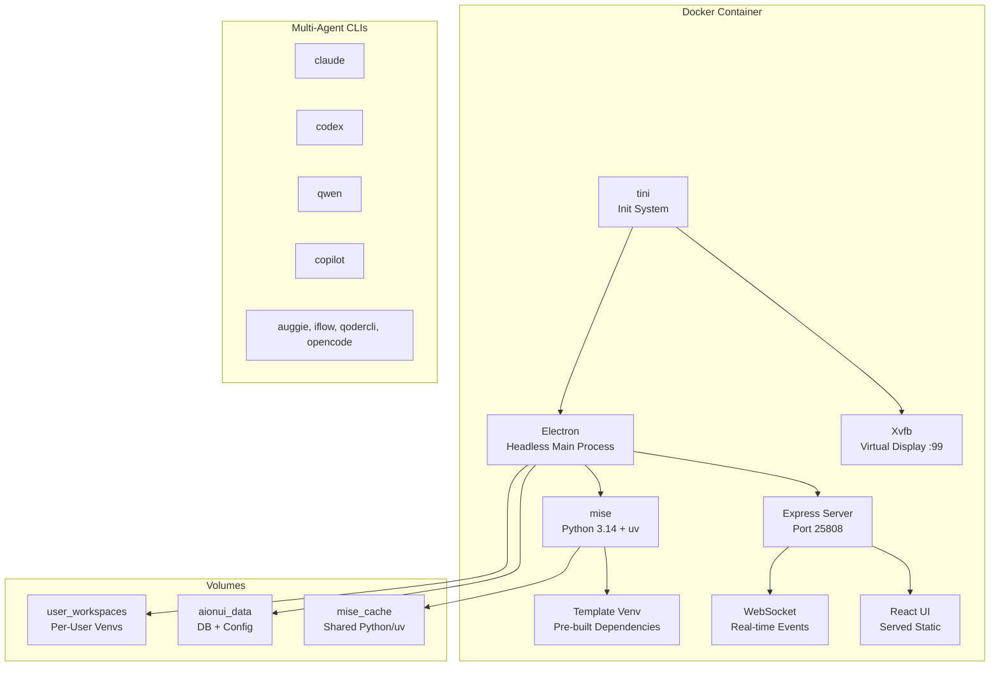

**Build Pipeline** (Hybrid Forge → electron-builder):

1. **Stage 1 — Build**: `electron-forge package` compiles webpack bundles (`.webpack/`) and rebuilds native modules (better-sqlite3, node-pty, bcrypt) against Electron's Node ABI
2. **Stage 2 — CLI Installer** (parallel): Installs all multi-agent CLI tools globally via npm
3. **Stage 3 — Runtime**: Minimal Debian bookworm-slim with Electron runtime deps, Xvfb, mise + Python 3.14, Playwright Chromium, template venv, LibreOffice for doc conversion

**Resource Defaults**: 4GB memory limit, 2 CPUs, 2GB shared memory (for Chromium)

### HTTPS Deployment (nginx Reverse Proxy)

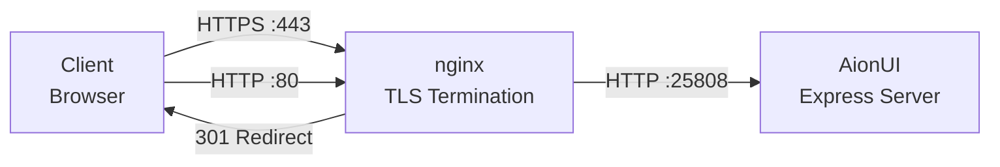

Activated via Docker Compose profile:

```bash
docker compose --profile https up -d
```

**Prerequisites:**
1. Place SSL certificates in `deploy/docker/ssl/` (`fullchain.pem`, `privkey.pem`)
2. Configure `nginx.conf` with your domain
3. Set environment variables:
   - `AIONUI_HTTPS=true` — Express sets `Secure` flag on cookies
   - `AIONUI_TRUST_PROXY=1` — Express trusts `X-Forwarded-Proto` from nginx

**Trust Proxy Configuration:**
- `true` — Trust all proxies
- Number (e.g., `1`) — Trust N hops
- String — Trusted subnet (e.g., `172.18.0.0/16`)
- Required for correct `req.protocol`, `req.ip`, and secure cookie behavior behind proxy

## Configuration

### Environment Variables

#### Core

| Variable | Description | Default |
|----------|-------------|---------|
| `AIONUI_PORT` | WebUI server port | `25808` |
| `AIONUI_ALLOW_REMOTE` | Enable remote/network access | `false` |
| `NODE_ENV` | Environment mode | `development` |
| `AIONUI_BRAND_NAME` | Custom branding (HTML title, etc.) | `AionUi` |
| `AIONUI_GITHUB_REPO` | Custom GitHub repo URL | — |
| `AIONUI_WEBSITE_URL` | Custom website URL | — |

#### Authentication

| Variable | Description | Default |
|----------|-------------|---------|
| `JWT_SECRET` | Secret for JWT signing (required for production) | Random per-start |
| `AIONUI_ADMIN_PASSWORD` | Admin account password (first-run setup) | — |
| `OIDC_ENABLED` | Enable OIDC SSO | `false` |
| `OIDC_ISSUER` | OIDC provider issuer URL | — |
| `OIDC_CLIENT_ID` | OIDC client ID | — |
| `OIDC_CLIENT_SECRET` | OIDC client secret | — |
| `OIDC_REDIRECT_URI` | OAuth callback URL | — |
| `OIDC_SCOPES` | OIDC scopes | `openid profile email` |
| `OIDC_GROUPS_CLAIM` | JWT claim containing group memberships | `groups` |

#### HTTPS / Proxy

| Variable | Description | Default |
|----------|-------------|---------|
| `AIONUI_HTTPS` | Mark cookies as Secure, enable HSTS | `false` |
| `AIONUI_TRUST_PROXY` | Express trust proxy setting | — |

#### Knowledge Base / Embeddings

| Variable | Description | Default |
|----------|-------------|---------|
| `EMBEDDING_MODEL` | Embedding model name | `text-embedding-3-small` |
| `EMBEDDING_API_KEY` | API key for embedding provider (falls back to `OPENAI_API_KEY`) | — |
| `EMBEDDING_API_BASE` | Custom embedding API endpoint | — |
| `EMBEDDING_DIMENSIONS` | Embedding vector dimensions | Provider default |

#### Observability

| Variable | Description | Default |
|----------|-------------|---------|
| `LANGFUSE_ENABLED` | Enable Langfuse LLM tracing | `false` |
| `LANGFUSE_HOST` | Langfuse host URL | `https://cloud.langfuse.com` |
| `LANGFUSE_PUBLIC_KEY` | Langfuse public key | — |
| `LANGFUSE_SECRET_KEY` | Langfuse secret key | — |
| `OTEL_ENABLED` | Enable OpenTelemetry export | `false` |
| `OTEL_EXPORTER_OTLP_ENDPOINT` | OTLP endpoint | — |
| `OTEL_SERVICE_NAME` | Service name for traces | `aionui` |
| `SYSLOG_ENABLED` | Enable syslog/SIEM forwarding | `false` |
| `SYSLOG_HOST` | Syslog host | — |
| `SYSLOG_PORT` | Syslog port | `514` |
| `SYSLOG_PROTOCOL` | `udp`, `tcp`, or `tls` | `udp` |

#### AI Provider Keys

| Variable | Description | Default |
|----------|-------------|---------|
| `ANTHROPIC_API_KEY` | Claude API key (container-level fallback) | — |
| `OPENAI_API_KEY` | OpenAI API key (container-level fallback) | — |
| `GEMINI_API_KEY` | Gemini API key (container-level fallback) | — |

#### Feature Flags

| Variable | Description | Default |
|----------|-------------|---------|
| `ALLOW_CLAUDE_YOLO` | Allow Claude agent auto-accept mode | `false` |
| `ALLOW_GEMINI_YOLO` | Allow Gemini agent auto-accept mode | `false` |

### Build Configuration

- **Electron Forge**: Webpack bundling and native module rebuild
- **Electron Builder**: Production packaging (`electron-builder.yml`)
- **Hybrid Pipeline**: Forge compiles `.webpack/` bundles → electron-builder packages into `out/linux-unpacked/`
- **Webpack**: Module bundling with filesystem cache for incremental rebuilds
- **UnoCSS**: Styling

### Docker Volumes

| Volume | Mount Point | Purpose |
|--------|-------------|---------|
| `aionui_data` | `/home/aionui/.config/AionUi` | SQLite database, config, sessions |
| `user_workspaces` | `/data/users` | Per-user Python venvs, skills, assistants |
| `mise_cache` | `/mise/cache` | Shared Python/uv downloads across restarts |

## Performance Considerations

- **Worker Processes**: AI agents run in isolated processes
- **Streaming**: Responses streamed to avoid memory buildup
- **Message Buffer**: Batched database writes for streaming
- **Virtualized Lists**: React Virtuoso for message lists
- **WAL Mode**: SQLite Write-Ahead Logging for concurrent read/write
- **Template Python Venv**: Pre-built venv copied in ~1s vs ~113s pip install per user. Eliminates per-user network downloads and rate-limiting at scale
- **Large File Exclusion**: Files >40KB excluded from direct context; routed through Knowledge Base RAG for selective retrieval instead of consuming entire context window
- **Stage-Based Ingestion Progress**: Real-time progress via streaming stderr (`extracting → chunking → embedding → indexing → complete`) with batch-level progress for embedding step
- **Manual Batch Embedding**: Embedding done in explicit batches with progress callbacks rather than relying on LanceDB auto-embedding, enabling UI progress tracking
- **Webpack Filesystem Cache**: Docker build mounts `.webpack-cache` for incremental rebuilds — only changed modules recompile
- **Parallel Docker Stages**: CLI installer stage builds in parallel with main build stage, cached independently of source changes
