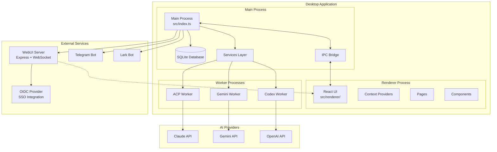
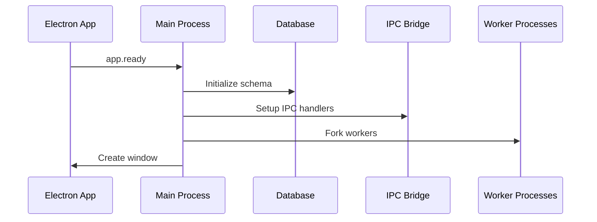
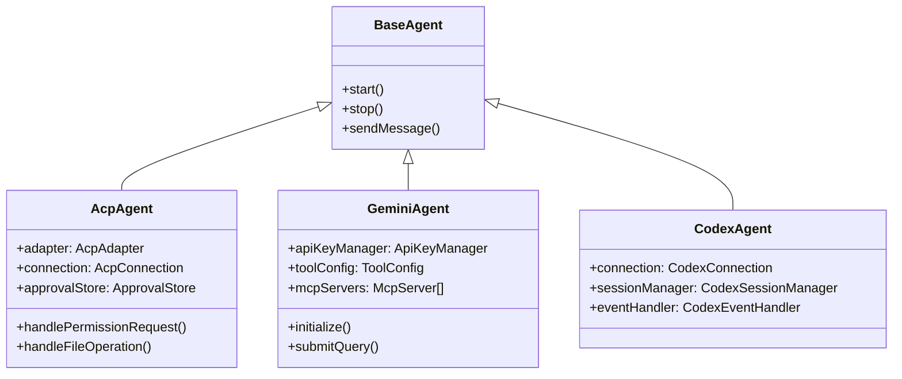
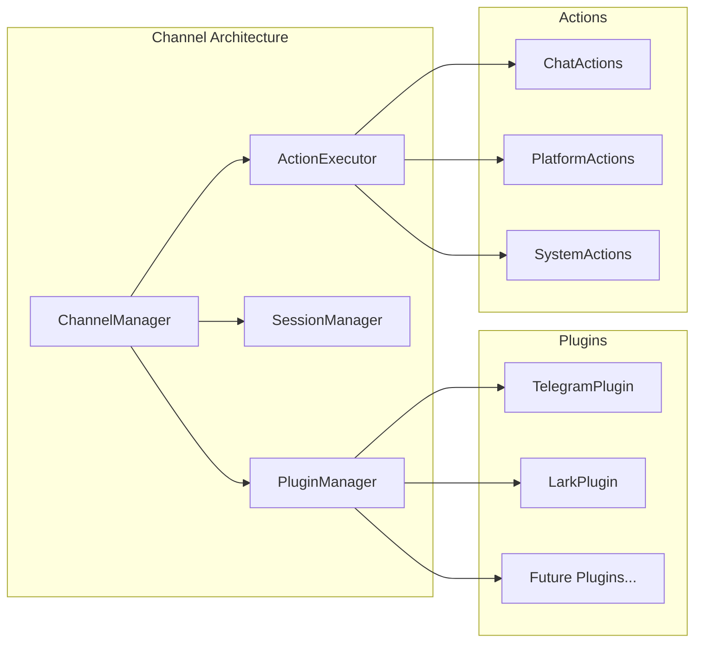
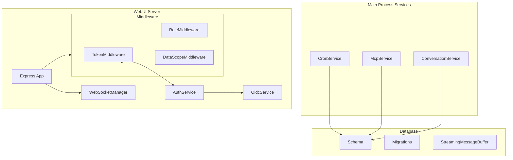
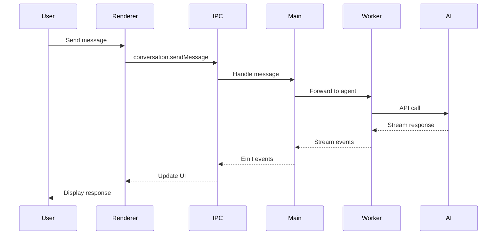
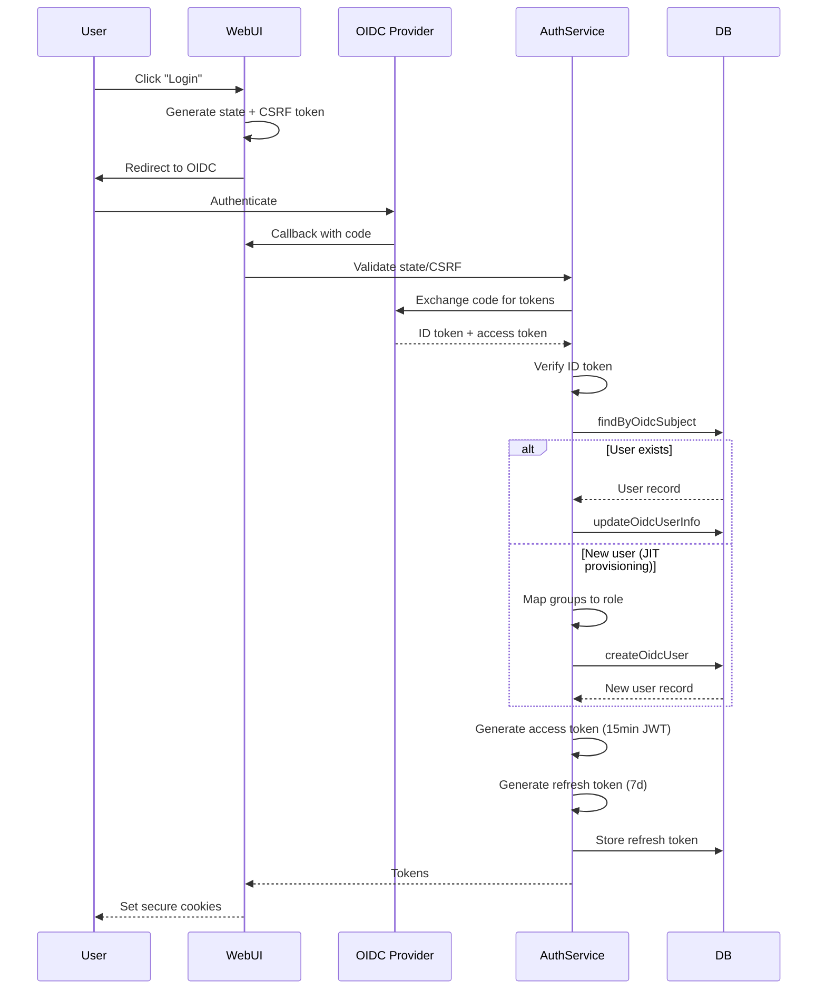
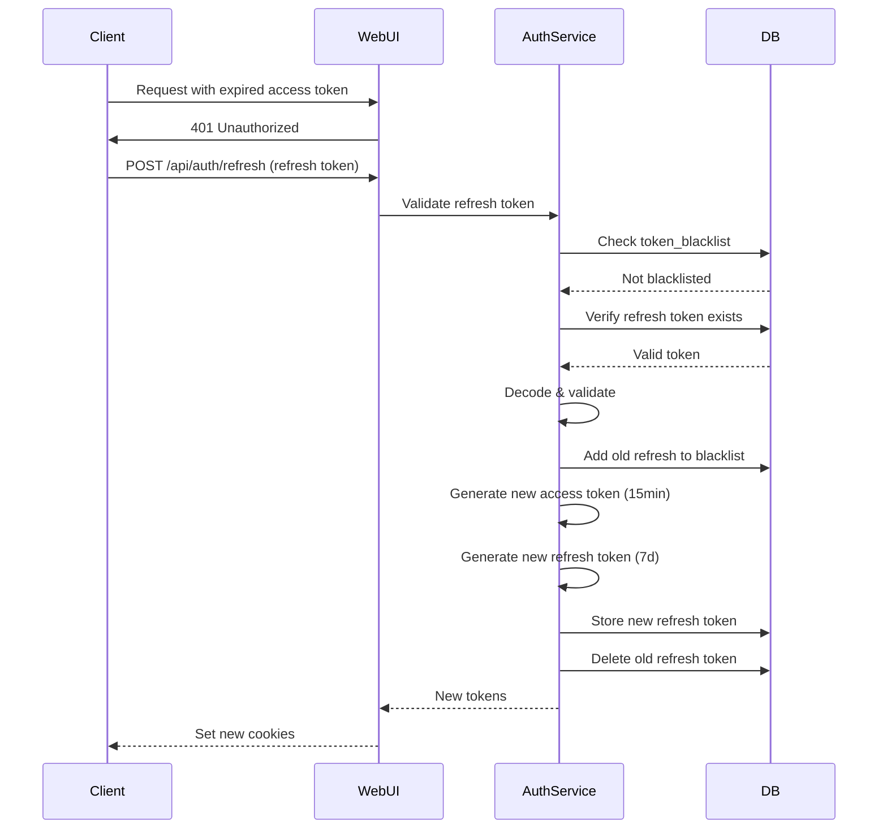
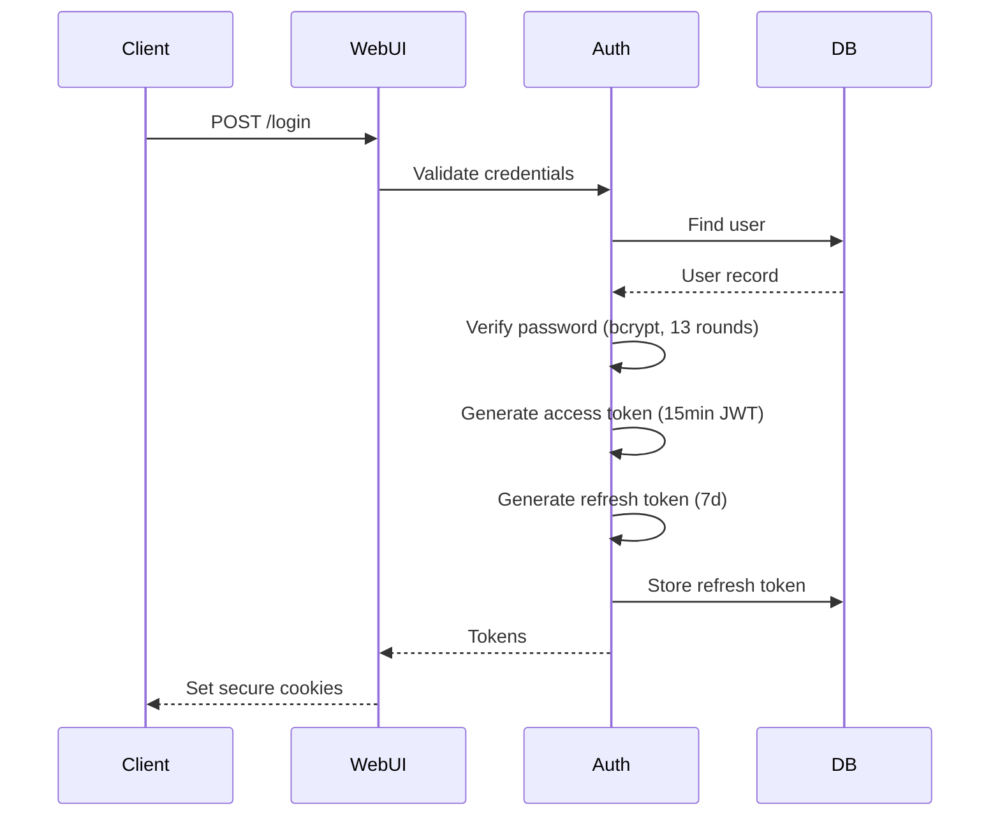

# AionUI Architecture Documentation

## Overview

AionUI is a multi-process Electron application that transforms CLI AI agents into a modern chat interface. It supports Claude Code (ACP), Google Gemini, and OpenAI Codex agents.

## System Architecture



## Process Model

### Main Process (`src/index.ts`)

The main process handles:

- **Application Lifecycle**: Window creation, app events
- **Database Operations**: SQLite via better-sqlite3
- **IPC Communication**: Bridge between renderer and main
- **Service Orchestration**: Managing agent workers and services



### Renderer Process (`src/renderer/`)

React-based UI with:

- **Pages**: Conversation, Settings, Cron, Login
- **Context Providers**: Auth, Conversation, Theme, Layout
- **Components**: Reusable UI components
- **Hooks**: Custom React hooks for state and effects

### Worker Processes (`src/worker/`)

Isolated processes for AI agents:

| Worker | File | Purpose |
|--------|------|---------|
| Gemini | `gemini.ts` | Google Gemini CLI integration |
| Codex | `codex.ts` | OpenAI Codex integration |
| ACP | `acp.ts` | Claude Code (ACP) integration |

## Component Architecture

### AI Agents



### Channel System



### Services Layer



## Data Flow

### Message Flow



### Authentication Flow (WebUI)

#### OIDC Authentication (Primary)



#### Token Refresh Flow



#### Local Authentication (Fallback)



## Database Schema

### Core Tables

```sql
-- Conversations
CREATE TABLE conversations (
    id TEXT PRIMARY KEY,
    title TEXT,
    type TEXT,
    workspace TEXT,
    created_at INTEGER,
    updated_at INTEGER
);

-- Messages
CREATE TABLE messages (
    id TEXT PRIMARY KEY,
    conversation_id TEXT,
    msg_id TEXT,
    type TEXT,
    content TEXT,
    status TEXT,
    position INTEGER,
    created_at INTEGER
);

-- Cron Jobs
CREATE TABLE cron_jobs (
    id TEXT PRIMARY KEY,
    name TEXT,
    schedule TEXT,
    conversation_id TEXT,
    message TEXT,
    agent_type TEXT,
    enabled INTEGER,
    last_run INTEGER,
    next_run INTEGER
);

-- Users (WebUI) - Schema v10
CREATE TABLE users (
    id TEXT PRIMARY KEY,
    username TEXT UNIQUE,
    password_hash TEXT,
    role TEXT DEFAULT 'user',           -- 'admin' or 'user'
    auth_method TEXT DEFAULT 'local',    -- 'local' or 'oidc'
    oidc_subject TEXT UNIQUE,            -- OIDC sub claim (for SSO users)
    display_name TEXT,                   -- User's display name
    groups TEXT,                         -- JSON array of group memberships
    created_at INTEGER,
    last_login INTEGER
);

-- Refresh Tokens - Schema v11
CREATE TABLE refresh_tokens (
    id TEXT PRIMARY KEY,
    user_id TEXT NOT NULL,
    token_hash TEXT NOT NULL,
    expires_at INTEGER NOT NULL,
    created_at INTEGER NOT NULL,
    FOREIGN KEY (user_id) REFERENCES users(id) ON DELETE CASCADE
);

-- Token Blacklist - Schema v11
CREATE TABLE token_blacklist (
    jti TEXT PRIMARY KEY,                -- JWT ID
    exp INTEGER NOT NULL,                -- Expiration timestamp
    blacklisted_at INTEGER NOT NULL
);

-- Global Models - Schema v16
-- Admin-managed shared model configurations
CREATE TABLE global_models (
    id TEXT PRIMARY KEY,
    platform TEXT NOT NULL,              -- e.g., 'openai', 'anthropic'
    name TEXT NOT NULL,                  -- Display name
    base_url TEXT NOT NULL DEFAULT '',   -- API endpoint
    encrypted_api_key TEXT,              -- AES-256-GCM encrypted
    models TEXT NOT NULL DEFAULT '[]',   -- JSON array of model names
    capabilities TEXT,                   -- JSON array (e.g., ["vision"])
    context_limit INTEGER,               -- Token limit
    custom_headers TEXT,                 -- JSON object for gateway headers
    enabled INTEGER NOT NULL DEFAULT 1,  -- 1=active, 0=disabled
    priority INTEGER NOT NULL DEFAULT 0, -- Display order (higher=first)
    created_by TEXT NOT NULL,            -- Admin user ID
    created_at INTEGER NOT NULL,
    updated_at INTEGER NOT NULL,
    FOREIGN KEY (created_by) REFERENCES users(id)
);

-- User Model Overrides - Schema v16
-- Tracks per-user overrides for global models
CREATE TABLE user_model_overrides (
    id TEXT PRIMARY KEY,
    user_id TEXT NOT NULL,
    global_model_id TEXT NOT NULL,
    override_type TEXT NOT NULL,         -- 'hidden' or 'modified'
    local_provider_id TEXT,              -- If modified, user's local copy ID
    created_at INTEGER NOT NULL,
    updated_at INTEGER NOT NULL,
    FOREIGN KEY (user_id) REFERENCES users(id) ON DELETE CASCADE,
    FOREIGN KEY (global_model_id) REFERENCES global_models(id) ON DELETE CASCADE,
    UNIQUE(user_id, global_model_id)
);

-- Logging Config - Schema v17
-- Runtime-configurable logging settings
CREATE TABLE logging_config (
    id TEXT PRIMARY KEY DEFAULT 'singleton',
    pino_level TEXT NOT NULL DEFAULT 'info',
    pino_file_enabled INTEGER NOT NULL DEFAULT 0,
    pino_file_path TEXT,
    pino_file_frequency TEXT DEFAULT 'daily',
    otel_enabled INTEGER NOT NULL DEFAULT 0,
    otel_endpoint TEXT,
    otel_service_name TEXT DEFAULT 'aionui',
    syslog_enabled INTEGER NOT NULL DEFAULT 0,
    syslog_host TEXT,
    syslog_port INTEGER DEFAULT 514,
    syslog_protocol TEXT DEFAULT 'udp',
    syslog_facility INTEGER DEFAULT 1,
    langfuse_enabled INTEGER NOT NULL DEFAULT 0,
    langfuse_public_key TEXT,
    langfuse_secret_key TEXT,
    langfuse_base_url TEXT,
    updated_at INTEGER NOT NULL
);

-- Global Model Groups - Schema v18
-- Group-based access control for global models
CREATE TABLE global_model_groups (
    id TEXT PRIMARY KEY,
    global_model_id TEXT NOT NULL,
    group_name TEXT NOT NULL,
    created_at INTEGER NOT NULL,
    FOREIGN KEY (global_model_id) REFERENCES global_models(id) ON DELETE CASCADE,
    UNIQUE(global_model_id, group_name)
);
```

## IPC Communication

### Bridge Structure

```typescript
// src/common/ipcBridge.ts
const ipcBridge = {
  conversation: {
    create: { provider, invoker },
    sendMessage: { provider, invoker },
    stop: { provider, invoker },
    // ...
  },
  mcpService: {
    testMcpConnection: { provider, invoker },
    syncMcpToAgents: { provider, invoker },
    // ...
  },
  application: {
    openDevTools: { provider, invoker },
    // ...
  }
};
```

### Preload Script

```typescript
// src/preload.ts - Exposed to renderer
contextBridge.exposeInMainWorld('electron', {
  emit: (name, data) => ipcRenderer.send('channel', { name, data }),
  on: (name, callback) => { /* listener setup */ },
  getPathForFile: (file) => webUtils.getPathForFile(file),
  webuiGetStatus: () => ipcRenderer.invoke('webui:getStatus'),
  webuiChangePassword: (pwd) => ipcRenderer.invoke('webui:changePassword', pwd),
  webuiGenerateQRToken: () => ipcRenderer.invoke('webui:generateQRToken'),
  webuiResetPassword: () => ipcRenderer.invoke('webui:resetPassword'),
});
```

## Security Considerations

### Authentication & Authorization

#### Multi-Method Authentication

- **OIDC (Primary)**: Authorization code flow with PKCE support
  - State parameter validation for CSRF protection
  - Nonce validation in ID tokens
  - JIT (Just-In-Time) user provisioning
  - Group-based role mapping (configurable via `groupMappings.ts`)
- **Local (Fallback)**: Username/password with bcrypt (13 rounds)
- **Auth Methods**: `auth_method` column tracks authentication source

#### Token System

- **Access Tokens**: Short-lived JWT (15 minutes)
  - Contains: `userId`, `username`, `role`
  - Signed with HS256
  - Validated on every protected request
- **Refresh Tokens**: Long-lived database tokens (7 days)
  - Stored as bcrypt hash in `refresh_tokens` table
  - Single-use with automatic rotation
  - Revoked on logout or security events
- **Token Blacklist**: Persistent SQLite table
  - Tracks revoked JWT IDs (`jti` claim)
  - Checked on every token validation
  - Automatic cleanup of expired entries

#### OIDC Security

- **Provider Validation**: Issuer verification against discovery document
- **Token Verification**: ID token signature and claims validation
- **State/CSRF Protection**: Cryptographically random state parameter
- **Secure Redirect**: Callback URL validation
- **Subject Mapping**: OIDC `sub` claim → `users.oidc_subject`

#### Role-Based Access Control (RBAC)

- **Roles**: `admin`, `user`, `viewer`
- **Middleware**: `RoleMiddleware` with route-level enforcement
  - `requireAdmin`: Admin-only endpoints
  - `requireRole(role)`: Specific role requirements
  - `requireUser`: Any authenticated user
- **Data Isolation**: `DataScopeMiddleware` filters queries by `userId`
  - Conversations tagged with `__webUiUserId`
  - Users can only access their own data

### WebUI Security

- **CSRF Protection**: `tiny-csrf` middleware
  - Excluded routes: `/login`, `/api/auth/refresh`
  - Token validation on state-changing requests
- **Secure Cookies**:
  - `HttpOnly`: Prevents XSS access
  - `SameSite=Strict`: CSRF protection
  - `Secure`: HTTPS-only in remote mode
- **Security Headers**:
  - `Strict-Transport-Security`: HSTS enforcement
  - `X-Content-Type-Options: nosniff`
  - `X-Frame-Options: DENY`
  - `Permissions-Policy`: Restricts browser features
  - `Content-Security-Policy`: XSS mitigation
- **Input Validation**: Request body validation middleware
- **Rate Limiting**: User-based rate limiting (keyed by `userId` when authenticated)
  - Brute-force protection on login endpoints
  - Per-endpoint configurable limits

### WebSocket Security

- **User Tracking**: Each connection tagged with `userId`
- **User-Scoped Broadcasting**: `broadcastToUser(userId, event)`
- **Authentication Required**: Token validation on connection upgrade
- **Connection Isolation**: Users receive only their events

### Password Security

- **Hashing**: bcrypt with 13 rounds (cost factor)
- **No Plaintext Storage**: Passwords never logged or stored unencrypted
- **Hash Verification**: Timing-attack resistant comparison

### Agent Permissions

- **ApprovalStore**: Session-level permission caching
- **Permission Requests**: User confirmation for sensitive operations
- **File Operations**: Controlled access to workspace

## Deployment Modes

### Desktop Mode (Default)

- Full Electron application
- Local database
- Direct IPC communication

### WebUI Mode

```bash
npm run webui        # Local access only
npm run webui:remote # Network access enabled
```

- Express server on configurable port
- WebSocket for real-time updates
- JWT authentication required

## Configuration

### Environment Variables

| Variable | Description | Default |
|----------|-------------|---------|
| `AIONUI_PORT` | WebUI server port | 25808 |
| `WEBUI_REMOTE` | Enable remote access | false |
| `NODE_ENV` | Environment | development |

### Build Configuration

- **Electron Forge**: Development and packaging
- **Electron Builder**: Production builds
- **Webpack**: Module bundling
- **UnoCSS**: Styling

## Performance Considerations

- **Worker Processes**: AI agents run in isolated processes
- **Streaming**: Responses streamed to avoid memory buildup
- **Message Buffer**: Batched database writes for streaming
- **Virtualized Lists**: React Virtuoso for message lists
